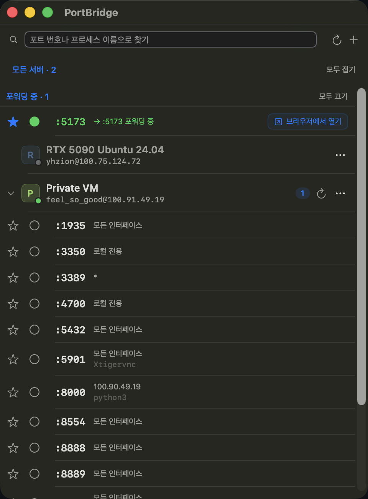
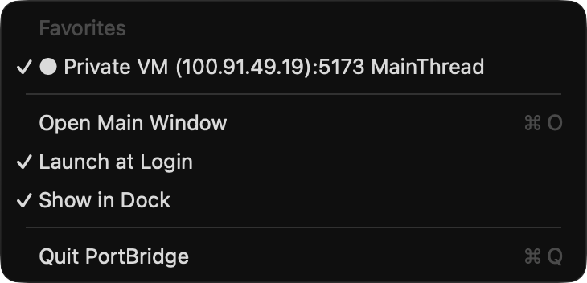

# PortBridge

> One-click SSH port forwarding from your macOS menu bar.

[](https://github.com/yhzion/PortBridge/releases)
[](https://github.com/yhzion/PortBridge/actions/workflows/release.yml)
[](LICENSE)


<p align="center">
  
</p>

PortBridge scans listening ports on hosts in your `~/.ssh/config` and forwards them to `localhost` with `ssh -L`. No more remembering long `-L` flags.

## Features

- 🔭 **Scan remote ports** automatically from `~/.ssh/config` hosts
- ⭐ **Pin favorites** for ports you use every day
- 🚀 **Launch at login** with favorite forwards started automatically
- 🍔 **Menu bar resident** — Dock icon optional, right-click toggles all favorites
- 🔁 **Resolve port conflicts** inline by picking a fallback local port
- 🌐 **Open in browser** with one click
- ✏️ **Edit servers safely** — auto-reconnects active forwards when identity changes, blocks duplicate `(user, host, port)` entries
- 🔔 **Update notifications** — checks GitHub Releases, shows a menu bar badge and first-detection banner (skip version or disable in menu)

<p align="center">
  
</p>

## Install

### One-liner

```bash
curl -fsSL https://raw.githubusercontent.com/yhzion/PortBridge/main/install-release.sh | bash
```

Downloads the latest release zip, installs to `/Applications/PortBridge.app`, and clears the quarantine attribute.

### Manual

1. Download `PortBridge.zip` from [Releases](https://github.com/yhzion/PortBridge/releases)
2. Unzip and move `PortBridge.app` to `/Applications`
3. If macOS blocks launch:
   ```bash
   xattr -dr com.apple.quarantine /Applications/PortBridge.app
   ```

## Requirements

- macOS 14 (Sonoma) or later
- SSH key authentication configured in `~/.ssh/config`
- Remote hosts: Linux with `ss` or `lsof` available

## Troubleshooting

**"App can't be opened because the developer cannot be verified"**

PortBridge ships ad-hoc signed — no Developer ID or notarization. Bypass once:

```bash
xattr -dr com.apple.quarantine /Applications/PortBridge.app
```

Or in Finder, right-click `PortBridge.app` → **Open** → **Open**.

## Build from source

### macOS app

```bash
apps/macos/install.sh
```

Requires Xcode. Builds Release, ad-hoc signs, and installs to `/Applications/PortBridge.app`.

### Rust workspace (core + CLI)

```bash
cargo build --workspace
```

Builds the shared core and the `portbridge` CLI. Requires a Rust toolchain.

## Repository structure

PortBridge is a polyglot monorepo. Platform-independent logic lives in a Rust core that is shared across the CLI, the macOS app (via FFI bindings), and future desktop targets.

| Path | Language | Purpose |
|------|----------|---------|
| `crates/portbridge-core/` | Rust | Platform-independent core logic (port scanning, parsing, error classification) |
| `crates/portbridge-cli/` | Rust | Cross-platform CLI — the `portbridge` binary (e.g. `portbridge scan user@host`) |
| `crates/portbridge-ffi/` | Rust | UniFFI bindings exposing the core to Swift and future Tauri targets |
| `apps/macos/` | Swift | macOS menu bar app (the shipping product) |
| `docs/` | — | Architecture, conventions, and design specs |
| `.github/` | — | CI workflows |

Coding conventions and the ownership-zone model that enables parallel work are documented in [AGENTS.md](AGENTS.md).

## Privacy

PortBridge contacts `api.github.com` only to check for new releases. See [docs/PRIVACY.md](docs/PRIVACY.md) for what is and isn't sent.

## License

MIT — see [LICENSE](LICENSE). This repository does not accept external contributions.
