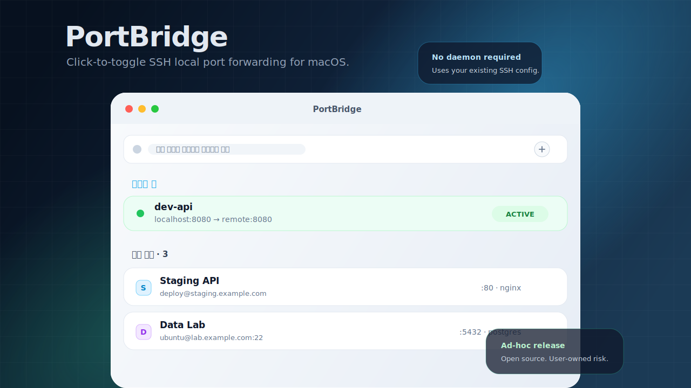

# PortBridge

macOS SwiftUI 기반 SSH 포트 포워딩 GUI.

`~/.ssh/config` 에 등록된 호스트의 리스닝 포트를 스캔하고, 선택한 포트를 로컬로 `ssh -L` 포워딩하는 간단한 도구.

<p align="center">
  
</p>

## 설치

### 한 줄 설치

```bash
curl -fsSL https://raw.githubusercontent.com/yhzion/PortBridge/main/install-release.sh | bash
```

이 방식은 GitHub Releases의 최신 `PortBridge.zip`을 내려받아 `/Applications/PortBridge.app`에 설치한다.
App Store나 Developer ID notarization을 사용하지 않는 ad-hoc 서명 배포이므로, 공개 배포보다는 지인/팀 내부 배포에 적합하다.
Apple Developer Program 등록 비용 부담 때문에 Developer ID 서명과 notarization은 적용하지 않았다.

### 수동 설치

1. [GitHub Releases](https://github.com/yhzion/PortBridge/releases)에서 최신 `PortBridge.zip` 다운로드
2. 압축 해제 후 `PortBridge.app`을 `/Applications`로 이동
3. 실행이 차단되면 아래 명령 실행

```bash
xattr -dr com.apple.quarantine /Applications/PortBridge.app
```

### 첫 실행 시 Gatekeeper

이 앱은 Developer ID로 notarize된 앱이 아니다. macOS가 "확인되지 않은 개발자" 경고를 띄우거나 실행을 차단할 수 있다.
서명되지 않은 배포물은 변조 여부를 운영체제가 강하게 보증하지 못하므로 보안에 취약할 수 있다. 설치와 사용 여부는 사용자가 직접 판단해야 한다.

- 한 줄 설치 스크립트는 설치 후 quarantine 속성을 제거한다.
- 그래도 차단되면 Finder에서 `/Applications/PortBridge.app` 우클릭 → **열기** → **열기**를 한 번 선택한다.
- 또는 위의 `xattr -dr com.apple.quarantine /Applications/PortBridge.app` 명령을 실행한다.

## 요구사항

- macOS 14 (Sonoma) 이상
- `~/.ssh/config` 에 SSH 키 인증으로 접근 가능한 호스트 등록
- 리모트가 Linux 인 경우 `ss` 또는 `lsof` 사용 가능

## 언제 유용한가

- 원격 서버의 개발 서버, DB, 내부 관리 UI를 내 Mac의 `localhost`처럼 열고 싶을 때
- `ssh -L 8080:127.0.0.1:8080 server` 같은 명령을 매번 기억하거나 복사하기 귀찮을 때
- 여러 SSH 호스트의 열린 포트를 훑어보고 필요한 포트만 빠르게 켜고 끄고 싶을 때
- 브라우저, DB 클라이언트, API 클라이언트는 로컬에서 쓰되 실제 서비스는 원격 서버에서 돌리고 싶을 때
- 팀 내부 도구, 개인 서버, 개발/스테이징 서버처럼 간단한 SSH 포워딩으로 충분한 환경에서 유용하다.

적합하지 않은 경우도 있다.

- 공개 인터넷에 서비스를 노출하거나, 장기 운영용 터널 관리가 필요한 경우
- 회사 보안 정책상 Developer ID 서명/notarization이 필수인 경우
- SSH 키, bastion, VPN, 접근 제어 정책을 앱이 대신 관리해주길 기대하는 경우

## 소스에서 빌드

```bash
./install.sh
```

- Xcode가 필요하다.
- Release 빌드 → ad-hoc 서명 → `/Applications/PortBridge.app` 으로 복사
- Launchpad / Spotlight / Dock 에서 일반 앱처럼 실행 가능
- 코드를 수정한 뒤 다시 한 번 `./install.sh` 만 실행하면 갱신됨

## 배포

`v*` 태그를 push하면 GitHub Actions가 macOS Release 빌드를 만들고, ad-hoc 서명한 `PortBridge.zip`과 `PortBridge.zip.sha256`을 GitHub Release에 업로드한다.

```bash
git tag v0.1.0
git push origin v0.1.0
```

## 라이선스와 책임

PortBridge는 오픈소스 소프트웨어이며, 상업적 사용이 가능하도록 MIT License로 배포한다.

- 사용, 복사, 수정, 배포, 사내 사용, 상업적 사용을 허용한다.
- 소프트웨어는 있는 그대로 제공되며, 개발자는 사용 결과나 이후 발생하는 문제에 책임을 지지 않는다.
- Developer ID 서명과 notarization이 없는 배포물이므로 보안 위험을 포함할 수 있으며, 설치·실행·사용에 따른 책임은 사용자 본인에게 있다.
- 배포물이나 수정본에는 원 저작권 고지와 라이선스 고지를 포함해야 한다.
- 이 저장소는 외부 contribution을 받지 않는다. Pull request, 기능 요청, 유지보수 요청은 처리하지 않을 수 있다.

자세한 조건은 [LICENSE](LICENSE)를 확인한다.

## 문서

- 설계: [docs/superpowers/specs/2026-05-11-portbridge-design.md](docs/superpowers/specs/2026-05-11-portbridge-design.md)
- 구현 계획: [docs/superpowers/plans/2026-05-11-portbridge-implementation.md](docs/superpowers/plans/2026-05-11-portbridge-implementation.md)
